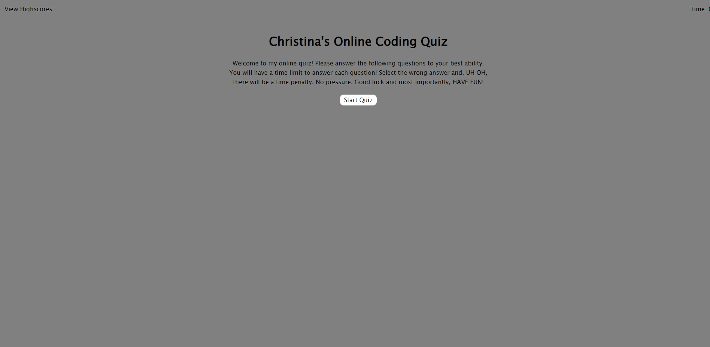

# Coding-quiz-challenge

## User Story:
```
AS A coding boot camp student
I WANT to take a timed quiz on JavaScript fundamentals that stores high scores
SO THAT I can gauge my progress compared to my peers
```

## Acceptance Criteria
```
GIVEN I am taking a code quiz
WHEN I click the start button
THEN a timer starts and I am presented with a question
WHEN I answer a question
THEN I am presented with another question
WHEN I answer a question incorrectly
THEN time is subtracted from the clock
WHEN all questions are answered or the timer reaches 0
THEN the game is over
WHEN the game is over
THEN I can save my initials and score
```

## Description:

Welcome to THE online quiz app! To start the quiz, please select the start button. From there you will be asked a series of questions with multiple choice answers. You must answer each question correctly or else time will be deducted from the timer! UH OH, no pressure! Once you answer all the questions, or the timer reaches 0 the game is over. Please enter you initials after to save your score! Thank you!

## Screenshot 



# Link to Deployed Site

https://christinaecb.github.io/Coding-quiz-challenge/

